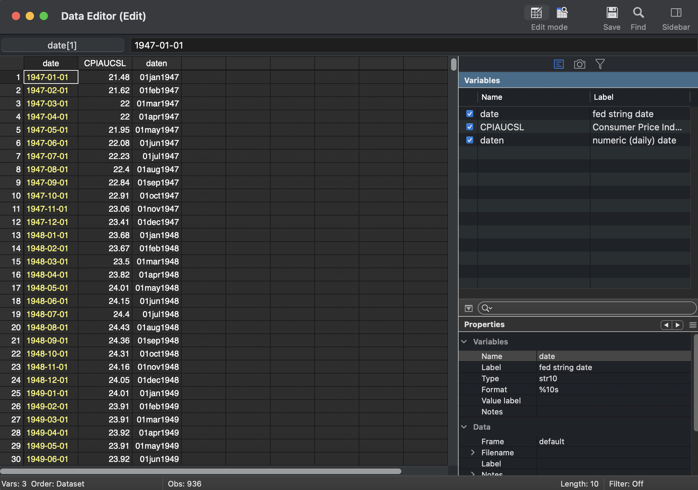

# Stata - Time Series Tutorial (ARIMA)
#### Preamble
This tutorial covers basic time series operations in Stata.

## Data Cleaning: Preparing the CPI Time Series Dataset

### Introduction
Before performing any time-series analysis, we must ensure that our dataset is properly structured, cleaned, and formatted. This section will:
- Import Consumer Price Index (CPI) data from the **Federal Reserve Economic Data (FRED)**.
- Convert and structure date variables appropriately.
- Filter the data to only include observations from **2008 to 2024**.
- Set the dataset up as a **time-series object** in Stata.
- Generate an initial visualization of the cleaned CPI data.

### 1️⃣ Loading and Cleaning the Data in Stata

Below is the Stata script used for cleaning the dataset, with detailed explanations for each step.

```stata
* Load the Consumer Price Index (CPIAUCSL) dataset directly from the FRED database
freduse CPIAUCSL, clear   
// Fetches data from the Federal Reserve Economic Data (FRED) API
// "CPIAUCSL" is the dataset identifier for the Consumer Price Index (CPI)
// "clear" ensures any previously loaded dataset is erased before loading the new one```

The raw uncleaned CPIAUCSL dataset looks like this when imported directly from FRED.



We will now clean the data.

```* Extract year and month components from the 'daten' variable (FRED's date format)
gen year = year(daten)   
// Creates a new variable 'year' that extracts the year from 'daten'

gen month = month(daten)  
// Creates a new variable 'month' that extracts the month from 'daten'

* Keep only data between the years 2008 and 2024
keep if (year >= 2008 & year <= 2024)  
// Filters the dataset to retain only observations where the year is between 2008 and 2024

* Remove unnecessary variables
drop daten year month  
// 'daten' is removed because we will replace it with a properly formatted date variable
// 'year' and 'month' were only used to filter the dataset and are no longer needed

* Convert the 'date' variable into a proper Stata date format
gen date_num = date(date, "YMD")  
// Converts the 'date' string variable into a numeric date format (YYYY-MM-DD)

format date_num %td  
// Assigns a readable date format to 'date_num' 

* Convert the daily date into a monthly format (necessary for time-series setup)
gen date_month = mofd(date_num)  
// Converts daily date values into monthly values

format date_month %tm  
// Assigns a readable monthly date format

* Remove redundant date variables now that 'date_month' is correctly formatted
drop date date_num  
// Removing intermediate variables to keep the dataset clean

* Rename 'date_month' to 'date' for clarity
rename date_month date  
// Standardizes the time variable to be called 'date'

* Organize the dataset for clarity
order date CPIAUCSL  
// Ensures 'date' appears first, followed by 'CPIAUCSL' for easier readability```

The data has now been cleaned. See how pretty it is?


* Declare the dataset as a time-series dataset using 'date' as the time variable
tsset date  
// This enables Stata to recognize the data as time-series

* Generate a time-series plot for CPIAUCSL
tsline CPIAUCSL  
// Creates a time series visualization of CPI over time

* Display the first 10 rows of the dataset for verification
list date CPIAUCSL in 1/10  
// Lists the first 10 observations to check correctness

* Save the cleaned dataset for future use
save "/Users/tylersotomayor/STATA/stata_tutorial-01/CPIAUCSL_2008-2024-clean-time.dta", replace  
// Saves the cleaned dataset in the specified location
